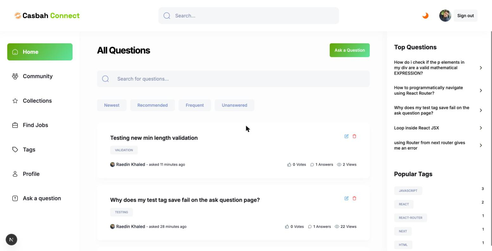
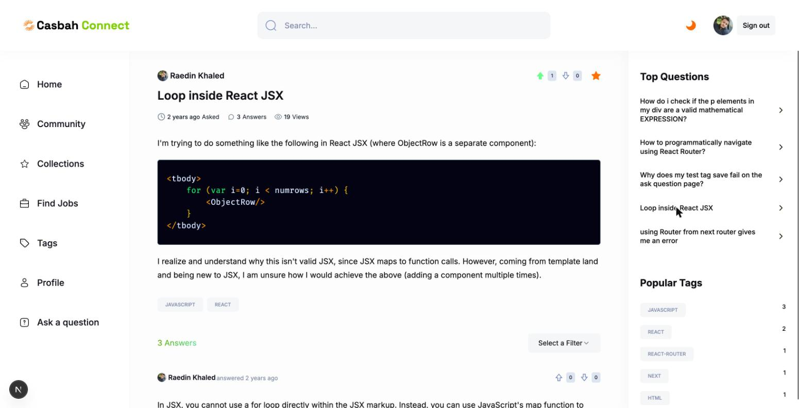
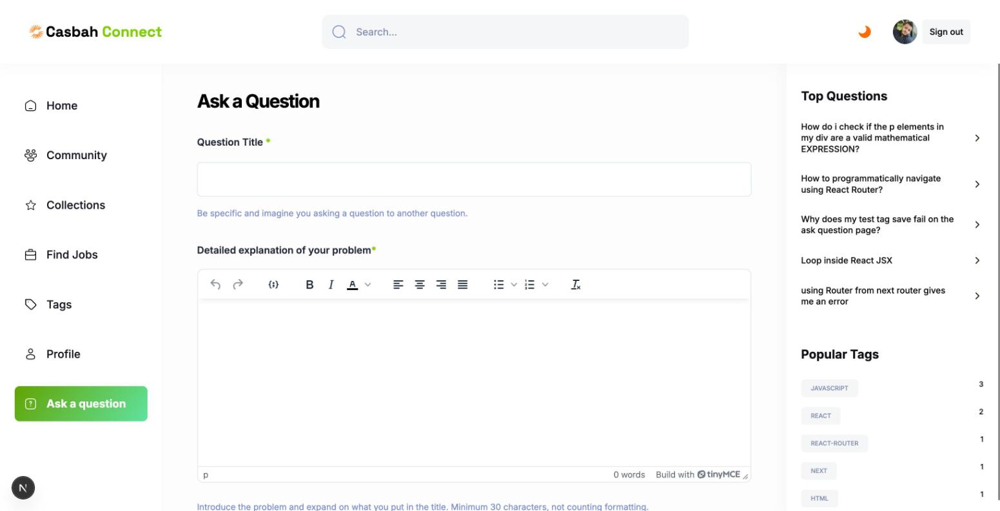
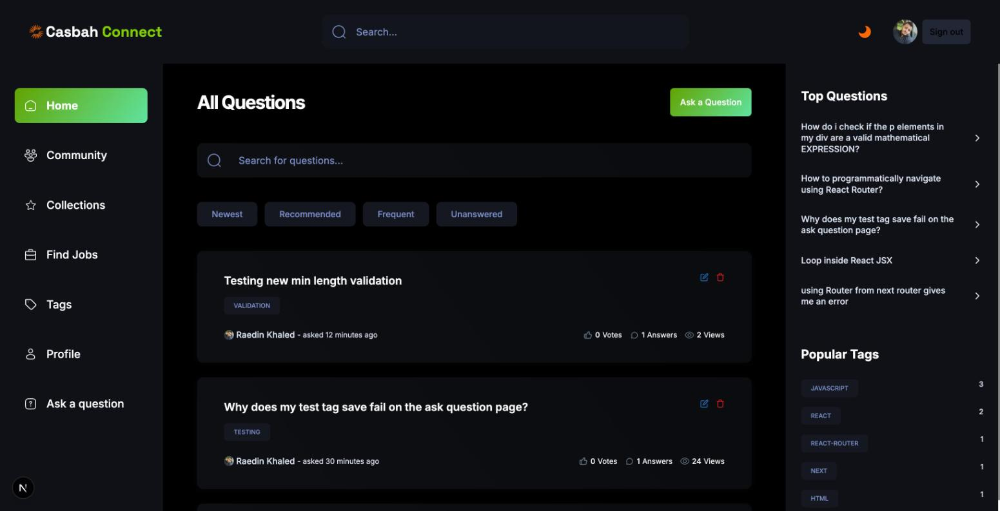

# Casbah Connect

A Stack Overflow–style Q&A platform for developers: ask questions, post answers, vote, save what matters, and build reputation — all with passwordless sign-in.

**Live demo:** https://casbah-connect.vercel.app/

    



## What it does

- **Ask & answer** with a rich text editor (TinyMCE) — code samples with syntax highlighting, formatting, images, and links
- **Tag questions** (up to 3 per question) and browse by tag
- **Vote** questions and answers up or down
- **Save** questions to a personal collection
- **Search** across questions, answers, tags, and users from the global search bar
- **Profiles** with reputation points, gold/silver/bronze badges, and tabs for a user's top questions and answers
- **Passwordless sign-in** — no password to create, remember, or leak; a magic link is emailed on request
- **One-click demo sign-in** — reviewers can explore without an email or account
- **Light / Dark / System** theme, fully responsive layout

|                                    |                                          |
| ---------------------------------- | ---------------------------------------- |
|  |  |
|  | |

## Stack

- **Framework:** Next.js 16 (App Router, Turbopack) with React 19 and TypeScript
- **Auth:** NextAuth v4, email magic-link provider, delivered through Resend SMTP
- **Database:** MongoDB 6.x with Mongoose for schemas and the official MongoDB adapter for NextAuth
- **Styling:** Tailwind CSS 4 (CSS-based `@theme` config) with Radix UI primitives for accessible components
- **Forms:** React Hook Form + Zod schema validation
- **Editor:** TinyMCE for question/answer content
- **Tooling:** ESLint flat config, TypeScript strict checks, npm

## Architecture & auth flow

Sign-in is fully passwordless: a visitor enters their email, NextAuth's `EmailProvider` sends a one-time magic link through Resend, and clicking it creates (or logs into) a MongoDB-backed account via `@auth/mongodb-adapter`. Sessions are signed JWTs valid for 30 days, and `session.user.id` is the account's MongoDB `_id` — that `_id` is the *only* identity used anywhere in the app, in profile URLs, authorship, votes, and saves.

Reviewers can also choose **Continue as Demo User**. The `demo` Credentials provider has no input fields and always returns the fixed, unprivileged identity `Demo User` (`demo@casbah-connect.local`). Its reserved ObjectId (`000000000000000000000001`) is compatible with the existing profile routes. The demo user is constructed in memory and is never saved to MongoDB. `isDemo` is set from the sign-in provider in the JWT and exposed as `session.user.isDemo`; existing email sessions default to `false`. The MongoDB adapter, SMTP configuration, and existing JWT session strategy remain unchanged. No new environment variables or seed step are required.

Route access is enforced in two layers:

1. **Edge middleware** (`proxy.ts`) redirects unauthenticated visitors away from protected pages (`/ask-question`, `/collection`, `/profile/edit`, `/question/edit/*`) before they render.
2. **Server actions** (`lib/actions/*`) never trust a client-supplied user id. Every authenticated mutation — creating a question, voting, saving, editing — derives the acting user from the server session via `requireWritableUser()`, which rejects demo sessions before database access. Edits/deletes additionally verify the caller owns the resource before touching it. Future mutations must use the same guard.

Public reads (browsing questions, profiles, tags) stay open to anyone. Demo mode is read-only: creating/editing/deleting questions and answers, voting (which changes reputation), saving questions, and profile changes are disabled. Demo question views also skip view-count and interaction writes. Demo collections and profile activity are empty; recommended questions fall back to the frequent feed. Search, filters, pagination, themes, and sign-out remain available. Demo mode uses the application's existing public content, so MongoDB must still be reachable for browsing. It does not simulate posting or maintain personal/shared demo state.

Navigation uses shared loading skeletons and streams the sidebar separately. Public sidebar rankings are cached for 60 seconds; sessions and account data remain uncached. Sign-in renders its form on the server, and sign-in/sign-out use client navigation with an auth refresh rather than reloading the document. Global search updates only its popover URL parameters, cancels obsolete GET requests, and searches collections concurrently. Community tag lookups are batched, profile statistics are combined, and list queries fetch only the fields their cards need. Syntax highlighting is scoped to the current post and deferred until the browser is idle.

## Security highlights

- No password ever exists for a user account — nothing to hash, rate-limit, or leak
- Every mutating server action re-derives the actor from the session; a request can't claim to be acting as another user
- Ownership is checked server-side before any edit or delete, independent of what the UI shows
- Secrets live only in environment variables; `.env.local` is git-ignored and was purged from repository history

## Getting started

**Requirements:** Node.js 22, npm 12, a MongoDB connection string, and a Resend account for outbound email.

```bash
git clone https://github.com/raedinkhaled/casbahconnect-next.git
cd casbahconnect-next
npm install
cp .env.example .env.local   # fill in your own values
npm run dev
```

Open [http://localhost:3000](http://localhost:3000).

### Environment variables

See `.env.example` for the full list with descriptions: `NEXTAUTH_URL`, `NEXTAUTH_SECRET`, `MONGODB_URL`, the `EMAIL_SERVER_*` / `EMAIL_FROM` Resend SMTP settings, and `NEXT_PUBLIC_TINY_EDITOR_API_KEY`.

### Scripts

| Command            | Description                          |
| ------------------ | ------------------------------------- |
| `npm run dev`       | Start the development server          |
| `npm run build`     | Production build                      |
| `npm run start`     | Serve the production build            |
| `npm run lint`      | Lint the codebase                     |
| `npm run typecheck` | Type-check without emitting output    |

## Project structure

```
app/                  # App Router routes, grouped by (root) and (auth)
components/
  forms/               # Question, answer, and profile forms
  cards/                # Question/answer/user card presentational components
  shared/               # Navbar, sidebar, search, votes, pagination, etc.
  ui/                    # Radix-based primitives (button, form, toast, ...)
lib/
  actions/             # Server actions — all data mutations and reads
  auth.ts, auth-user.ts # NextAuth config and session helpers
  validations.ts        # Zod schemas
database/              # Mongoose models
constants/              # Static config (nav links, filters, badge thresholds)
```

## Design decisions

- **MongoDB `_id` as the sole identity.** The app previously depended on a third-party auth provider's user IDs. Standardizing on the adapter-native MongoDB `_id` everywhere removed a layer of ID-mapping and an external dependency.
- **Passwordless over password auth.** No password storage, no reset-flow to build and secure, no credential-stuffing surface.
- **Server actions with mandatory server-derived identity.** Every mutation trusts the session, never a request parameter, for "who is doing this."

## Known limitations

- Search is a case-insensitive scan across collections, not a dedicated search index — adequate at this scale, but would move to a proper search index (e.g. Atlas Search) if usage grew.
- `npm test` covers authentication, demo restrictions, client auth navigation, search concurrency/cancellation, batched reads, and syntax highlighting using isolated external-service substitutes. Live email delivery and browser interaction still need deployment QA.
- The "Find Jobs" section is a placeholder for a future job board — not yet implemented.

## Recent upgrade

The project was migrated from a Clerk-based stack to a self-hosted, passwordless authentication model and brought current across the framework:

- Replaced Clerk with **NextAuth v4** email magic-link authentication (Resend SMTP), backed by the MongoDB adapter
- Standardized on MongoDB `_id` as the single source of identity across the app, removing the external ID system entirely
- Added server-side ownership checks and a shared current-user helper so every mutation is authorized against the session, not client input
- Upgraded to **Next.js 16**, **React 19**, and **TypeScript 6**, converting App Router route params/search params to their async form
- Migrated to **Tailwind CSS 4**'s CSS-based configuration and an **ESLint flat config**
- Modernized the TinyMCE integration to its controlled-component API, removing legacy imperative editor refs
- Hardened question/answer form validation to measure actual written content rather than raw HTML markup length, with clear inline error messages
- Rotated and purged previously committed credentials from git history

## Author

**Raedin Khaled** — [github.com/raedinkhaled](https://github.com/raedinkhaled)
